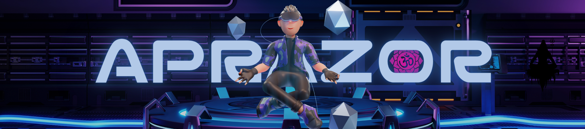

  

 

## 👤 About

**Infrastructure & Network Engineer** managing data center networking and bare-metal Kubernetes across **10+ global sites**. I design, automate, and monitor production infrastructure — from switch ports to pod deployments.

 

**Infrastructure & Kubernetes** — Bare-metal Kubernetes, Helm charts for production services, CI/CD with Concourse, PXE boot provisioning at scale

**Networking** — BGP/OSPF routing across data centers, Juniper JunOS switch management, FortiGate firewalls, MetalLB load balancing

**Automation & IaC** — Python/Ansible network automation, Terraform, MCP servers for AI-powered device management, Zero Touch Provisioning

**Observability** — Prometheus/Grafana dashboards & alerting, VictoriaMetrics, automated incident diagnostics, Git-versioned config backup

 

## ⚙️ Tech Stack

 

## 🌱 Open Source Contributions

| Project | Stars | Merged | What I Contributed |
|:--------|:-----:|:------:|:-------------------|
| [**srl-labs/containerlab**](https://github.com/srl-labs/containerlab) | ⭐ 2.5k | **8 PRs** | Nil panic fixes, resource leak patches, error propagation across node types, certificate handling |
| [**prometheus/snmp_exporter**](https://github.com/prometheus/snmp_exporter) | ⭐ 2.1k | **2 PRs** | SNMPv3 EngineID hex decode fix, generator output file handle leak |
| [**prometheus-community/fortigate_exporter**](https://github.com/prometheus-community/fortigate_exporter) | ⭐ 200+ | **2 PRs** | Swapped min/max metric names, FortiOS 7.4+ version comparison fix |

> **12 merged PRs** across 3 projects — plus **15+ open PRs** in containerlab, kube-router, blackbox_exporter, gobgp, and more.

 

## 📈 GitHub Stats

 

## 🚀 What I've Built

> Production tools built at work — descriptions kept generic, but these are real systems running in production.

 

**📡 VLAN Automation Platform** · 

Full-stack app automating VLAN discovery and configuration across 100+ data center switches. Route-based detection with 100% accuracy in production.

   

---

**🤖 Network Alert Bot** · 

Monitors Prometheus alerts, SSHes into network devices, runs diagnostics, and posts results to team chat. Handles 18+ alert types — reduces MTTR for on-call engineers.

   

---

**💾 Network Config Backup** · 

Automated network device config backup and versioning across 4+ data centers. Tracks every config change via Git. Deployed on Kubernetes with REST API access.

   

---

**📐 Zero Touch Provisioning** · 

Automated bare-metal switch bootstrapping. New switch gets plugged into the rack, receives its config via DHCP + NETCONF, and joins the network — no human needed.

   

---

**☸️ Bare-Metal Kubernetes Platform** · 

Multi-cluster bare-metal Kubernetes across 10+ global data centers. Authored Helm charts for MetalLB (BGP + L2), Kea DHCP, Oxidized, and the full monitoring stack. Per-datacenter values overlays, PXE boot provisioning for worker nodes, and CI/CD via Concourse pipelines.

     

 

## 💬 Let's Connect

---

 

