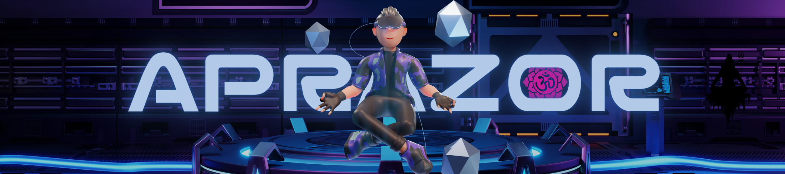

  <!-- Typing SVG by DenverCoder1 - https://github.com/DenverCoder1/readme-typing-svg -->
  

# 🚀 About

- Skilled Collaborator 🤝
- Commited High Achiever 🏆
- Effective Communicator 🎙
- Rapid and Adaptive ⚡️
- Problem Solver 💡
- Ask me about DevOps, Cloud Technologies and Networking

# 🛠 Tech Stack

 
  
  &nbsp;&nbsp;&nbsp;

  &nbsp;&nbsp;&nbsp;

  &nbsp;&nbsp;&nbsp;

  &nbsp;&nbsp;&nbsp;

  &nbsp;&nbsp;&nbsp;

  &nbsp;&nbsp;&nbsp;
 
  &nbsp;&nbsp;&nbsp;

  &nbsp;&nbsp;&nbsp;

  &nbsp;&nbsp;&nbsp;
 
 
 

# 🌟 Favourite Projects

    
    
    

